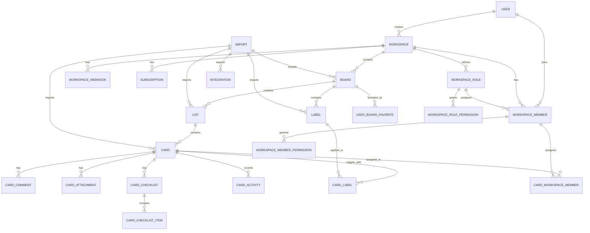

# Database Structure

This document summarizes the PostgreSQL schema used by Kan.

Primary schema source:

- `packages/db/src/schema/`

## Core Model

## Main Tables

### Workspaces and Membership

- `workspace`: top-level tenant; stores plan, slug, card prefix, and card counter.
- `workspace_members`: membership records for users invited to a workspace.
- `workspace_roles`: custom workspace roles.
- `workspace_role_permissions`: permission grants attached to a role.
- `workspace_member_permissions`: direct permission overrides per member.
- `workspace_invite_links`: reusable invite links for joining a workspace.
- `workspace_slugs`: reserved or premium slugs.
- `workspace_slug_checks`: historical slug availability checks.

### Boards and Organization

- `board`: board metadata, visibility, archive state, template/source linkage, and board colors.
- `user_board_favorites`: user-to-board favorites join table.
- `list`: ordered board lists; now includes `borderColor`.
- `label`: board-scoped labels.

### Cards and Activity

- `card`: core work item with title, description, list, due date, card number, and `borderColor`.
- `_card_labels`: many-to-many join between cards and labels.
- `_card_workspace_members`: many-to-many join between cards and workspace members.
- `card_comments`: card discussion entries.
- `card_attachment`: uploaded file metadata for cards.
- `card_checklist`: checklist containers on cards.
- `card_checklist_item`: checklist items.
- `card_activity`: immutable activity stream for card changes.

### Auth and Users

- `user`: canonical user record.
- `account`: external auth provider accounts.
- `session`: active login sessions.
- `verification`: auth verification payloads.
- `apiKey`: API keys.

### Billing, Imports, Integrations, Notifications

- `subscription`: workspace subscription state.
- `import`: import jobs (for example Trello imports).
- `integration`: external integration records.
- `notification`: in-app notifications.
- `workspace_webhooks`: outgoing workspace webhooks.
- `feedback`: feedback submissions.

## Key Relationships

- A `workspace` owns many `boards` and `workspace_members`.
- A `board` owns many `lists` and `labels`.
- A `list` owns many `cards`.
- A `card` can have many `labels`, `members`, `comments`, `attachments`, `checklists`, and `activities`.
- A `card_checklist` owns many `card_checklist_item` rows.
- A `workspace_member` can inherit permissions from `workspace_roles` and receive direct overrides from `workspace_member_permissions`.

## Ordering and Soft Deletion

- Ordered entities use integer `index` columns:
  - `list.index`
  - `card.index`
  - `card_checklist.index`
  - `card_checklist_item.index`
- Most user-facing entities use soft deletion with `deletedAt` and sometimes `deletedBy`.
- Public-facing entities typically expose 12-character `publicId` values rather than internal numeric IDs.

## Color Fields

- `board.backgroundColor`
- `board.borderColor`
- `list.borderColor`
- `card.borderColor`

Card color inheritance rule:

- New cards may default to the parent list's `borderColor` when no explicit card color is provided.

## Notes

- The schema uses Drizzle ORM with PostgreSQL enums, foreign keys, indexes, and row-level security enabled on application tables.
- Migration files live under `packages/db/migrations/`.
- For the definitive source of truth, prefer the files in `packages/db/src/schema/` over this summary.